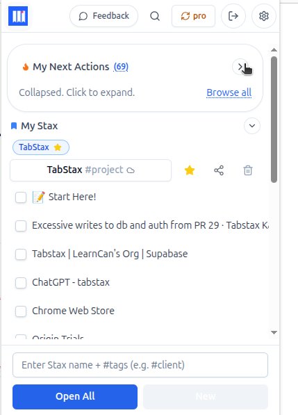
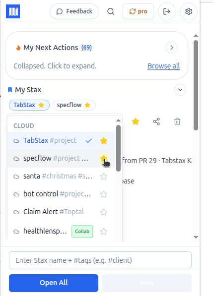

[← Back to Help Home](../README.md)

# Adding Favourites

## Why this helps

When you're deep in a project season—maybe billing week, or a launch sprint—you don't want to scroll through a long list every time you switch contexts. Favourites let you pin the Stax that matter *right now* to the top, so your brain doesn't have to search. It's a focus filter: keep the current priorities visible, and everything else stays one click away when you need it.

---

## How to favourite a Stax

1. Open the **My Stax** dropdown.
2. Click the **Stax you want to favourite** to expand it.
3. Click the **star icon** in the header bar.

The Stax now appears as a **pill** above your Stax list—quick access without opening the dropdown.

---

## What you get

* **Up to 3 pills** appear above the list at any time. Click a pill to open that Stax directly.
* **Favourite as many as you like**—they'll all appear at the top of the dropdown, marked with a star. The pills just show the top 3 for focus.

---

## How to unfavourite

1. Click the Stax in the dropdown to expand it.
2. Click the **star icon** again to remove the favourite.

The pill disappears and the Stax drops back into its normal spot in your list.

---

## Now you can…

Keep your current priorities one click away without scrolling. When a project wraps or a deadline passes, unfavourite it and promote the next thing that matters. If everything is a priority, nothing is—three pills keeps your focus tight.

---

**Related guides:**
- [Understanding the main popup](using_the_main_popup.md) – navigate next actions and open Stax
- [Creating your first Stax](creating_your_first_stax.md) – step-by-step guide with a real example
- [What is a Stax?](what_is_a_stax.md) – deep dive into the core concept
